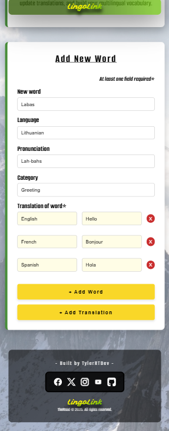
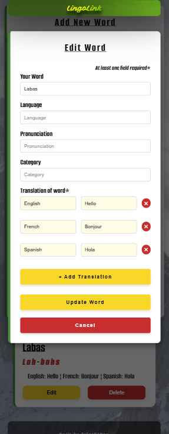

# LingoLink - Track & Learn Words Across Languages


## 🔗 Live Project

- 🌍 Live Site: [https://tylerrtdev.github.io/CI-MSProject3/](https://tylerrtdev.github.io/CI-MSProject3/)
- 💻 GitHub Repo: [TylerRTDev/CI-MSProject3](https://github.com/TylerRTDev/CI-MSProject3)

---

## Table of Contents

- [User Experience (UX)](#-user-experience-ux)
  - [Project Goals](#project-goals)
  - [Target Audience](#target-audience)
  - [User Goals](#user-goals)
  - [User Value](#user-value)
  - [Color Scheme](#color-scheme)
  - [Typography](#typography)
  - [Wireframes/Design](#wireframes)

- [Features](#-features)
  - [General](#general)
  - [Landing Page](#landing-page)
  - [Future Enhancements](#-future-enhancements)

- [Technologies Used](#-technologies-used)
  - [Languages Used](#languages-used)
  - [Frameworks, Libraries and Programs Used](#frameworks-libraries-and-programs-used)
  - [Data Model](#data-model)

- [Deployment](#-deployment)
- [Finished Product](#-finished-product)
- [Author and Contact](#-author-and-contact)
- [Testing Documentation](TESTING.md)

## 🧠 User Experience (UX)

### Project Goals

The goal of this project is to create a multilingual vocabulary tracker called **LingoLink**, designed to help users build and manage their vocabulary across multiple languages. The app provides a smooth user interface for adding, editing, and deleting vocabulary entries, each with support for translations, pronunciation, and categorisation. It is built mobile-first to ensure usability on all screen sizes, and integrates with a backend database to persist user data.

### Target Audience

- Language learners at any stage — beginners to advanced
- Multilingual individuals managing vocabularies across several languages
- Students studying languages in school or university
- Anyone wanting to track vocabulary consistently and efficiently

### User Goals

- Add new words with translations and optional pronunciation or category
- View all added words in an organized card format
- Edit existing entries quickly using a clean modal interface
- Delete entries they no longer want
- Use the app seamlessly across mobile and desktop devices

### User Value

- 📚 **Multi-language support** – Users can track and translate vocabulary across multiple languages, not just one-to-one translation.




- 🧠 **Pronunciation assistance** – Allows users to add pronunciation guides to help with accurate speech and memory retention.


- 🧩 **Smart translation entries** – Supports multiple translations for one word with flexible language pairs.


- 🔁 **Edit-friendly** – Users can easily update entries via a responsive modal system without refreshing the page.




- 📱 **Mobile-first interface** – Designed with mobile responsiveness in mind for learning on the go.


- 🚀 **Fast performance** – Instant UI feedback when adding, editing, or deleting words via JavaScript interactions.

> [See Postman Testing For Response Times](/TESTING.md)

- ☁️ **Persistent cloud storage** – All words are saved securely in the cloud using MongoDB Atlas.


---

### Color Scheme

The color scheme is inspired by the Lithuanian flag, consisting of:

- **Yellow** (`#fdd835`) – Used for primary buttons and highlights
- **Green** (`#388e3c`) – Used in headers and UI accents
- **Red** (`#d32f2f`) – Used for alerts, delete buttons, and emphasis
- **White** (`#ffffff`) – Used for background panels and forms
- **Dark Grey** (`#212121`) – Used for body text and header contrast
- **Light Grey** (`#f5f5f5`) – Used for background and section separation

This palette was chosen for its brightness, contrast, and accessibility.

### Typography

The primary font used is:

- **Segoe UI**, with fallbacks: `Tahoma, Geneva, Verdana, sans-serif`

This typeface was selected for its clean readability, strong support across browsers, and familiarity in modern UIs.

### Wireframes/Design

Wireframes were created to plan the mobile-first layout and user interaction flow and 

- Mobile wireframes focus on a vertical stacking structure, prioritising form inputs and large tap targets.
- Desktop layouts make use of central alignment and spacing for easy readability.

#### Wireframe Designs

<details>
<summary>Skeleton</summary>
<br>

Hero Section


Forms


Word Cards


</details>

#### Figma Designs

<details>
<summary>Mobile, Tablet & Desktop</summary>
<br>

490px


1024px


1920px


</details>
---

## 🌟 Features

LingoLink is a full-stack language learning tool that helps users add, manage, and track vocabulary across multiple languages. It includes the following core features:

### ✅ General Features
- Add a new word with optional pronunciation and category
- Add multiple translations for each word
- Edit word entries via modal pop-up
- Delete entries with confirmation handling
- Form validation to ensure translations are always present
- Responsive UI optimized for mobile and desktop

### 🖼 Landing Page
- Includes branding, tagline, and call-to-action
- Gradient hero background and animated transitions
- Sticky navigation bar with login/register buttons

### 📋 Word Catalogue
- Displays all user-added words
- Each word card shows the base word, pronunciation, and its translations
- "Edit" button opens modal with prefilled inputs
- "Delete" button removes the word and updates the UI

### 🌱 Future Enhancements

Here are features planned for future versions of LingoLink:

- ✅ **Search and filter** – Ability to search words and filter by category or language
- 🎮 **Gamification** – Add challenge mode, badges, and scoreboards
- 💾 **User authentication** – Enable login and secure user-specific word storage
- 📈 **Progress tracking** – Visual indicators for how many words learned per session
- 🔊 **Audio pronunciation** – Add audio clips for each word
- 📝 **Dark mode toggle** – Theme switch for light/dark accessibility
- 🔄 **Undo/Redo actions** – Enhance UX for edits and deletions
- 📋 **Pagination** – Manage large word collections with paginated views


## 🧰 Technologies Used

### Languages Used
- HTML5
- CSS3
- JavaScript (ES6+)
- Python (Flask backend)
- MongoDB
- Render (Cloud Deployment)

### Frameworks, Libraries and Programs Used
- [Flask](https://flask.palletsprojects.com/) – Python web framework for API and backend logic
- [PyMongo](https://pymongo.readthedocs.io/) – Interact with MongoDB Atlas
- [MongoDB Atlas](https://www.mongodb.com/cloud/atlas) – Cloud-hosted NoSQL database
- [Render](https://render.com) – Deployed Flask backend
- [GitHub Pages](https://pages.github.com/) – Deployed frontend
- [Postman](https://www.postman.com/) – Manual API testing
- [dotenv](https://pypi.org/project/python-dotenv/) – Manage environment variables

## 🗂️ Database Structure

LingoLink uses MongoDB Atlas, a cloud-based NoSQL database, where each vocabulary entry is stored as a self-contained document. While NoSQL databases do not follow traditional relational database structures, the application’s data model mirrors a one-to-one structure.

#### 📄 Document Example
```json
{
  "_id": "ObjectId",
  "word": "Labas",
  "language": "Lithuanian",
  "pronunciation": "Lah-bahs",
  "category": "Greeting",
  "translations": {
    "English": "Hello",
    "Spanish": "Hola"
  }
}
```

### ✅ Design Justification
- All metadata and translations for a word are bundled in a single document.
- Eliminates the need for complex joins or foreign key references.
- Fast to retrieve, edit, and delete entries in a single call.
- Well-suited to MongoDB’s document-based data model.

This allows for rapid CRUD operations while preserving data clarity and simplicity.

- All fields are required and at least one `translation` must be added.
- `translations` is a key-value object where each key is a language name and the value is its corresponding translation.

---

## 🚀 Deployment

This project is deployed using two services:

### 🔧 Backend (Flask API)
- Hosted on: [Render](https://render.com)
- Repository includes `requirements.txt`, `Procfile`, and `.env` (not tracked).
- Environment Variables:
  - `MONGO_URI` — Secure database connection string
  - `DB_NAME` — MongoDB database name

### 🎨 Frontend (Static Hosting)
- Hosted on: [GitHub Pages](https://github.com/TylerRTDev/CI-MSProject3)
- `scripts.js` connects to the deployed Flask API using the `API_BASE` constant
- No build tool required — app loads directly from `index.html`

### 📂 Version Control

All development was tracked using Git with regular commits and branch usage.  
The full project history is available via the public [GitHub repository](https://github.com/TylerRTDev/CI-MSProject3).

### 🛠 Local Deployment
To run the project locally:

1. **Clone the repository**
```bash
git clone https://github.com/TylerRTDev/CI-MSProject3.git
```
2. **Navigate to the backend folder**
```bash
cd CI-MSProject3
```
3. **Create and activate a virtual environment**
```bash
python3 -m venv venv
source venv/bin/activate  # On Windows: venv\Scripts\activate
```
4. **Install dependencies**
```bash
pip install -r requirements.txt
```
5. **Set up a `.env` file** with your credentials:
```
MONGO_URI="your_mongo_connection_string"
SECRET_KEY="your_secret_key"
```
6. **Run the Flask server**
```bash
python app.py
```
7. Open `index.html` in your browser for the frontend.

> ⚠️ **IMPORTANT:** When running locally, your `scripts.js` should point to:
```javascript
const API_BASE = "http://127.0.0.1:5000";
```
This ensures your frontend communicates with the Flask server running on your machine.

---

### ☁️ Render Deployment (Cloud Backend) - Optional

Render is a cloud hosting platform that allows you to deploy full-stack web applications easily. Below are beginner-friendly steps to deploy your Flask backend using Render.

#### 📦 Prerequisites
- A free Render account (sign up at [render.com](https://render.com))
- A GitHub repository with your project pushed and accessible
- Your `app.py`, `requirements.txt`, and `Procfile` in the root of the repo

#### 🚀 Step-by-step Guide
1. **Log into [Render](https://render.com)** and click on **"New Web Service"**.
2. **Connect your GitHub account** and select your CI-MSProject3 repository.
3. **Fill out the deploy settings**:
   - **Name:** Give your app a name (e.g., `lingolink-backend`)
   - **Environment:** Set to `Python 3`
   - **Build Command:** *Leave blank*
   - **Start Command:** `python app.py` (or use `gunicorn` if preferred)

4. **Set the environment variables** under the "Environment" tab:
```
MONGO_URI = your MongoDB Atlas connection string
DB_NAME = lingolink
```

5. **Ensure your repo includes:**
   - `app.py` (entry point)
   - `requirements.txt` (all dependencies)
   - `Procfile` (optional but useful for flexibility)

Example `Procfile`:
```
web: python app.py
```

6. Click **Create Web Service** – Render will build and deploy your app.

> Once deployed, you will be given a live URL like `https://your-app-name.onrender.com`

#### 🌐 Adjusting Your Frontend
Make sure your frontend’s JavaScript file points to the correct deployed API:

```javascript
// Local development:
// const API_BASE = "http://127.0.0.1:5000";

// Production:
const API_BASE = "https://your-app-name.onrender.com";
```

💡 You can toggle between the two using a comment or a simple environment flag if needed.

---

### ☁️ MongoDB Atlas Setup

MongoDB Atlas is a cloud-based NoSQL database used to store word data. Here’s how to set it up if you’ve never used it before:

### 🛠 Step-by-step MongoDB Atlas Setup
1. **Create a MongoDB Atlas account** at [https://www.mongodb.com/cloud/atlas](https://www.mongodb.com/cloud/atlas)
2. **Create a new project** and name it (e.g. `LingoLink Project`)
3. **Build a cluster** using the free tier (Shared Cluster → AWS → region closest to you)
4. **Create a database user**:
   - Go to Database Access > Add New Database User
   - Set a username and password (make note of this for later)
   - Assign read and write access to any database
5. **Whitelist your IP address**:
   - Go to Network Access > Add IP Address
   - Choose "Allow Access From Anywhere" (`0.0.0.0/0`) for development
6. **Create a new database**:
   - Go to Clusters > Browse Collections > Create Database
   - Name your database (e.g. `lingolink`) and collection (e.g. `words`)
7. **Copy the connection string**:
   - Go to Clusters > Connect > Choose "Connect your application"
   - Copy the URI that looks like:
```bash
mongodb+srv://<username>:<password>@clustername.mongodb.net/?retryWrites=true&w=majority
```
   - Replace `<username>` and `<password>` with the values you chose

8. **Paste it into your `.env` file**:
```bash
MONGO_URI="your full connection string"
SECRET_KEY="your_secret_key"
```

You’re now ready to connect your backend (Flask) to MongoDB Atlas securely!

---

## ✅ Finished Product

The final product provides all the required CRUD functionality, featuring:

- A mobile-first layout for easy accessibility
- Smooth UI transitions and modals for editing
- Multi-translation word entries
- Persistent storage via a MongoDB database
- Instant updates to the word catalogue via a JavaScript frontend

Users can create, view, update, and delete word entries, including support for categories and pronunciation. The project meets all core requirements for a backend-focused application using a NoSQL database.


## 👤 Author and Contact

Created by **Tyler Kerr**  
📧 GitHub: [TylerRTDev](https://github.com/TylerRTDev)  
🌍 Portfolio: [https://tkdev-portfolio.netlify.app/](https://tkdev-portfolio.netlify.app/)  
📫 Contact via [Instagram](https://www.instagram.com/tylerrtdev/) or [X/Twitter](https://x.com/TylerRTDev)